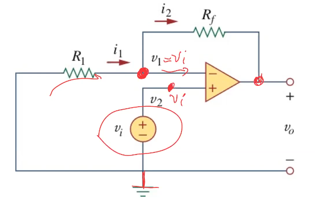
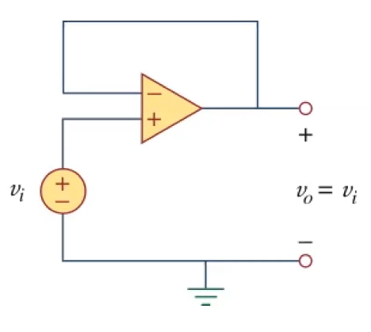
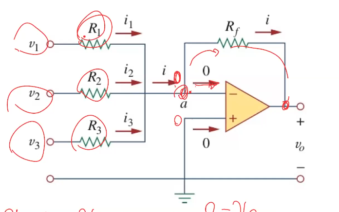
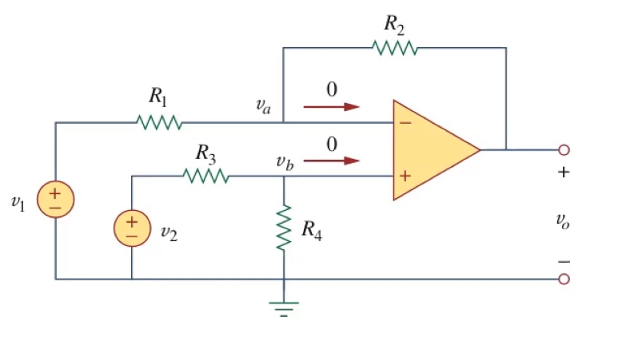
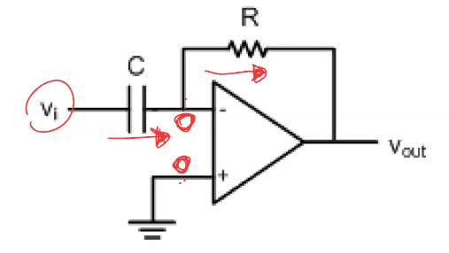
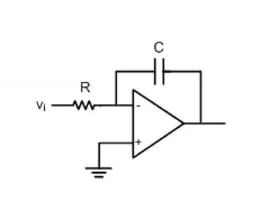

# Twelfth Class
* OpAmps
  * Usually used with negative feedback
    * Normally fed into negative terminal of OpAmp
  * Golden rules
    * $V_P=V_N$
    * $I_P=I_N=0$
  * Designed to do mathematical operations
  * Strategy
    * Check if there is negative feedback
    * Input currents are 0
    * Do nodal analysis
    * Solve for result
* Non inverting amplifier
  * 
* Buffer
  * 
* Summing amplifier
  * 
* Difference amplifier
  * 
  * Subtraction if $R_2=R_4$ and $R_1=R_3$
  * $V_0=-\frac{R_2}{R_1}(V_1-(\frac{R_4}{R_3+R_4})(1+\frac{R_1}{R_2})V_2)$
* Differentiator
  * 
  * $V_{out}=-RC\frac{dv_i}{dt}$
* Integrator
  * 
  * $\frac{dV_{out}}{dt}=-\frac1{RC}v_i$, $V_0=\frac1{RC}\int v_idt$