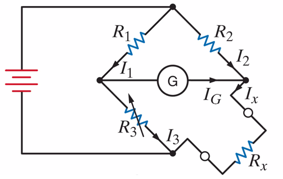
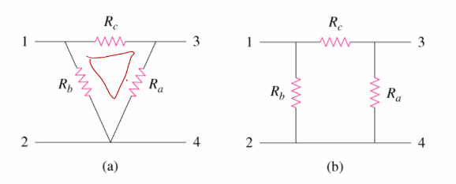

# Third Class
* Wheatstone bridge
	* Accurate device for measuring resistance
	* Center leg contains a galvonometer (measures current)
	* When unknown resistor is connected, $R_3$ is adjusted until the current in the gavlonimeter is zero, at which point it is balanced
	* When balanced, $\frac{R_1}{R_3}=\frac{R_2}{R_x}$
	* 
* Why and Delta Networks
	* Delta
    * Looks like triangle
	* Dye
	* Looks like a Y
    * Three terminal network 
    * 