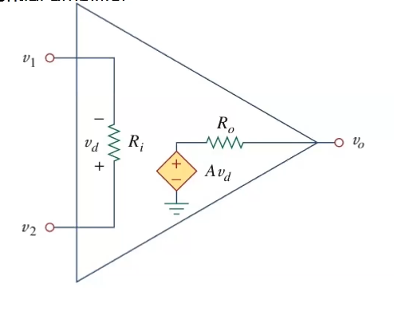

# Eleventh Class
* Amplifiers
  * Usually have input and output voltage
  * Typicaly have two supplies, one positive and one negative
  * Get's saturated if going beyond power supply
  * Can be modelled by voltage controlled voltage source
    * $R_{out}$ very small, $R_{in}$ very large
* Differential amplifiers
  * Two inputs and amplifies the potential difference between its input nodes
  * Makes more resistant to noise
  * 
    * In ideal case, $R_i\to\infty, R_0=0, A\to\infty$
  * Gain is very large, ideally infinite