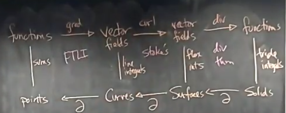

# Thirty-Second Class
* e.g. Compute $\oint_C\vec F\cdot d\vec r, \vec F=<\tan\sqrt{1+x^2}, zy+e^{y^3}, \frac{x^2}2+\sqrt[3]{\sin z^2}>, \vec r(t)=<\sin t, \cos t, -\sin 2t>, 0\leq t\leq 2\pi$
  * Last time we found $curl\vec F=<-y, -x, 0>$ (last time the signs were wrong)
  * We can use stokes, we need $S$ such that $\partial S=C$
  * To find such an $S$ we should understand $C$
    * $z=-2xy, x^2+y^2=1$ (since $\sin 2t=2\sin t\cos t$)
  * For $S$, change to $z=-2xy, x^2+y^2\leq 1$
    * Need downward orientation
    * $\vec r(x, y)=<x, y, -2xy>, \{x^2+y^2\leq 1\}$ oriented downwards
    * $\vec r_x=<1, 0, -2y>, \vec r_y=<0, 1, -2x>, \vec r_x\times \vec r_y=<2y, 2x, 1>$ which is opposite of normal, so have to add sign
  * $\oint_C\vec F\cdot d\vec r=\iint_S curl\vec F\cdot d\hat S=-\iint_{\{x^2+y^2\leq1\}}<-y, -x, 0><2y, 2x, 1>=2\iint_{\{x^2+y^2\leq 1\}}x^2+y^2dxdy=2\int_0^{2\pi}\int_0^2 r^3drd\theta=2\cdot 2\pi\cdot [\frac{r^4}{4}]_0^1=\pi$
  * Alternative parameterization would have been just a cylinder with a disk on the bottom at $z=-A$
    * $\iint_S curl\vec F\cdot d\hat S=\iint_{S_1}<-y, -x, 0>\cdot\hat N_1 dS_1+\iint_{S_2}<-y, -x, 0>\cdot \hat N_2dS_2$
    * $S_2$ vanishes since $\vec N$ is perpendicular to the curl
    * $\vec r(\theta, z)=<\cos\theta, \sin\theta,  z>, 0\leq\theta\leq2\pi, -A\leq z\leq -2\sin\theta\cos\theta$
    * $\iint_{S_1} curl\vec F\cdot d\hat S=\int_0^{2\pi}\int_{-A}^{-2\sin\theta\cos\theta}<-\sin\theta, -\cos\theta, 0><\cos\theta, \sin\theta>dzd\theta=\int_0^{2\pi}(\sin^22\theta-A\sin2\theta)d\theta=\pi$
* e.g. Find $\oint_C\vec F\cdot d\vec r, \vec F=<z^2, x, yz>$, $C=C_1+C_2+C_3+C_4+C_5$ which represents line segments going from $(0, 0, 2)\rightarrow(1, 1, 0)\rightarrow(3, 0, 0)\rightarrow (circular) (0, 3, 0)\rightarrow(0, 0, 2)$
  * Could do this by hand with $5$ line integrals
  * Can also use Stoke's instead
  * $curl\vec F=<z, 2z, 1>$
  * Surface is surface on $xy$ and $yz$ plane
  * Triangle has parameterization $z=2-\frac23 y$
  * $\oint_C\vec F\cdot d\vec r=\iint_{S_1}<z, 2z, 1><1, 0, 0>dS_1+\iint_{S_2}<z, 2z, 1><0, 0, 1>dS_2=\int_0^2\int_0^{3-\frac32 z}zdydz+Area(S_2)=[\frac32 z^2-\frac12z^34]_0^2+\frac94\pi-\frac32=\frac94\pi+\frac12$
* Diagram for next class
  * Functions $\underbrace{\rightarrow}_{grad=\vec \nabla}$ Vector fields $\underbrace{\rightarrow}_{curl=\vec \nabla\times}$ Vector fields $\underbrace{\rightarrow}_{div=\vec \nabla\cdot}$Functions
  * Can extend this for integrals as well
  * 