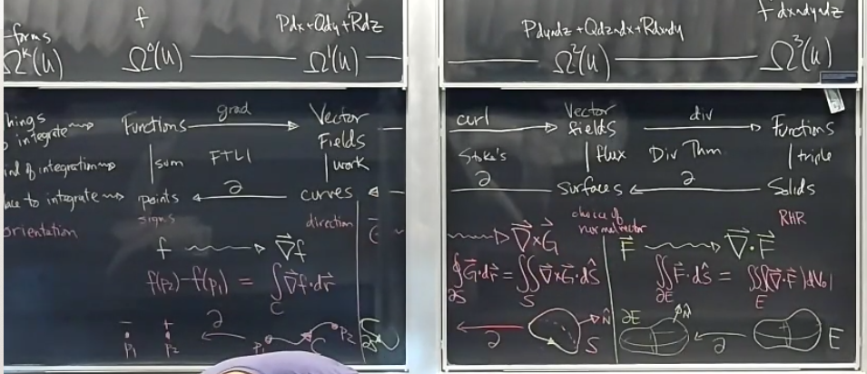

# Thirty-Third Class
* Differential forms
  * Let $x_1, \ldots, x_n$ be coordinates on $\R^n$
  * We will define the wedge product of differential forms as follows
    * Consider symbols $dx_1, \ldots, dx_n$
    * Wedge product satisfies $dx_i\wedge dx_j=-dx_j\wedge dx_1$
    * Let $u\sub\R^n$ be an open subset
    * Define differential $k$-form to be a linear combination of $k$-fold wedge products of $dx_i$s with coefficients which are functions
  * For example Let $x, y, z$ be coordinates on $\R^3$
    * A 1-form is $Pdx+Qdy+Rdz$
    * Any 2 form can be written $Pdy\wedge dz+Qdz\wedge dx+Rdx\wedge dy$
      * Why? $dy\wedge dx=-dx\wedge dy\Rightarrow dx\wedge dx=0$
    * All $3$-forms on $U\sub R^3$ can be written $f dx\wedge dy\wedge dz$
    * No $k$-forms for $k>3$
    * A $0$-form on $U\sub\R^3$ is just $f$
  * We can extend wedge products to all $k$-forms
    * Multiply out and apply wedge rules
  * Notation: $\Omega^k(u)$ is set of all $k$ forms $k$-form
  * $\wedge:\Omega^k(u)\times\Omega^\ell(u)\rightarrow \Omega^{k+\ell}(u)$
    * Example: $P_1dx+P_2 dy+P_3 dz)\wedge(Q_1dx+Q_2dy+Q_3 dz)=P_1Q_1dx\wedge dx+P_1Q_2dx\wedge dy+P_1Q_3dx\wedge dz+P_2Q_1 dy\wedge dx+P_2Q_2 dy\wedge dy+P_2Q_3dy\wedge dz+P_3Q_1 dz\wedge dx+P_3Q_2 dz\wedge dy+P_3Q_3 dz\wedge dz\\=(P_2Q_3-P_3Q_2)dy\wedge dz+(P_3Q_1-P_1Q_3)dz\wedge dx+(P_1Q_2-P_2Q_1)dx \wedge dy$
      * Corresponds to cross product
      * Definitely made at least one typo
  * Under dictionary $\wedge : \Omega^1(u)\times\Omega^1(u)\rightarrow\Omega^2(u), \omega, \alpha\rightarrow\omega\times\alpha$
    * Similarly $\wedge : \vec F, \vec G\rightarrow\vec F\times\vec G$
  * $\wedge:\Omega^1(u)\times\Omega^2(u)\rightarrow\Omega^3(u)$
    * $(P_1dx+Q_1dy+R_1dz)\wedge(P_2dy\wedge dz+Q_2 dz\wedge dx+R_2dx\wedge dy)=P_1P_2dx\wedge dy\wedge dz+Q_1Q_2 dy\wedge dz\wedge dx+R_1 R_2 dz\wedge dx\wedge dy=(P_1P_2+Q_1Q_2+R_1R_2)dx\wedge dy\wedge dz$
      * Corresponds to dot product $<P_1, Q_1, R_1>\cdot <P_2, Q_2, R_2>$
* The one derivative to rule them all (exterior derivative)
  * $d:\Omega^k(u)\underbrace{\rightarrow}_{d}\Omega^{k+1}(u)$ defined as follows: 
    * if $k=0$ $df=\frac{\partial f}{\partial x}dx+\frac{\partial f}{\partial y}dy+\frac{\partial f}{\partial z}dz$
    * In general, apply $d$ to coefficients and then expand with wedge product
  * Example: $d(Pdx+Qdy+Rdz)=dP\wedge dx+dQ\wedge dy+dR\wedge dz=(P_xdx+P_ydy+P_zdz)\wedge dx+(Q_xdx+Q_ydy+Q_2dz)\wedge dy+(R_x dx+R_ydy+R_zdz)\wedge dz\\=P_ydy\wedge dx+P_zdz\wedge dx+Q_xdx\wedge dy+Q_z dz\wedge dy+R_ydx\wedge dz+R_ydy\wedge dz\\=(R_y=Q_z)dy\wedge dz+(P_z-R_x)dz\wedge dx+(Q_x-P_y)dx\wedge dy$
    * Corresponds to curl
  * Example: $d(Pdy\wedge dz+Q dz\wedge dx+R dx\wedge dy)=(P_x+Q_y+R_z)dx\wedge dy\wedge dz=div<P, Q, R>$ (I'm not writing all that work out again)
  * $d$ satisfies 
    * $d(d\omega)=0$
    * $\alpha\in\Omega^k(u), \beta\in\Omega^\ell(u), d(\alpha\wedge\beta)=(d\alpha)\wedge\beta+(-1)^k\alpha\wedge d\beta$
* e.g. $\alpha$ $0$-form, $\beta$ $1$-form
  * $d(\alpha\wedge\beta)=d\alpha\wedge\beta+\alpha\wedge d\beta$
  * $\vec{curl}(f\vec F)=\vec\nabla f\times\vec F+f\vec{curl}\vec F$
* e.g. $\alpha$ is a $1$-form, $\beta$ is a $1$-form
  * $d(\alpha\wedge\beta)=d\alpha\wedge\beta+\alpha\wedge d\beta$
  * $div(\vec F\times\vec G)=\vec{curl}\vec F\cdot\vec G-\vec F\cdot\vec{curl}\vec G$

