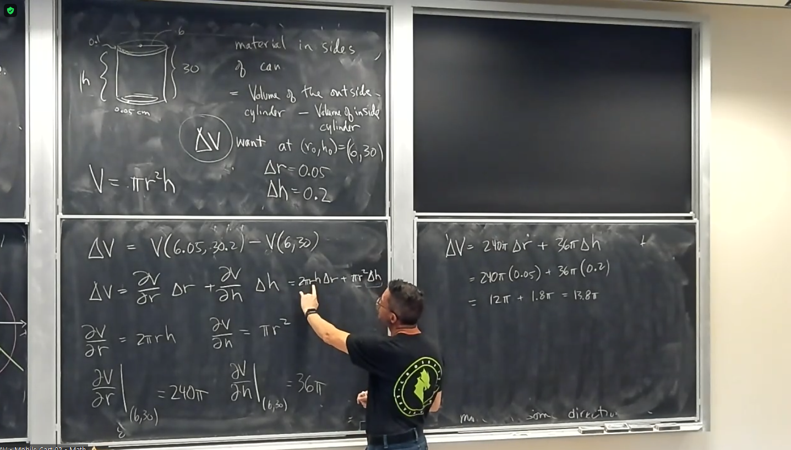

# Ninth Class
* Linear approximation can be rewritten as 
  * $\Delta z\approx\frac{\partial z}{\partial x}\Delta x+\frac{\partial z}{\partial y}\Delta y$
  * $dz=\frac{\partial z}{\partial x}dx+\frac{\partial z}{\partial y}dy$
* Chain rule
  * $y=f(g(x)), \frac{dy}{dt}=f^\prime(g(t))g^\prime(t)$
  * $y=f(x), x=g(t), \frac{dy}{dt}=\frac{dy}{dx}\frac{dx}{dt}$
  * $\sout\binom{\partial z}{\partial x}$
  * If $z=f(x=g(t), y=h(t), \frac{dz}{dt}=\frac{\partial z}{\partial x}\frac{dx}{dt}+\frac{\partial z}{\partial y}\frac{dy}{dt}$
  * $z=f(x, y), x=g(t, s), y=h(t, s)$
  * $z=f(g(t, s), h(t, s))$
  * $\frac{\partial z}{\partial t}=\frac{\partial z}{\partial x}\frac{\partial x}{\partial t}+\frac{\partial z}{\partial y}\frac{\partial y}{\partial t}$
  * $\frac{\partial z}{\partial s}=\frac{\partial z}{\partial x}\frac{\partial x}{\partial s}+\frac{\partial z}{\partial y}\frac{\partial y}{\partial s}$
* e.g. Switching to polar coordinates
  * $z=f(x, y), x=x(r, \theta=r\cos\theta, y=y(r, \theta)=r\sin\theta$
  * Can write as matrix
  * Problem: rewrite the PDE $(\frac{\partial z}{\partial r})^2+\frac1{r^2}(\frac{\partial z}{\partial \theta})^2=0$
  * $0=(\frac{\partial z}{\partial x}\cos\theta + \frac{\partial z}{\partial y}\sin\theta)^2+\frac1{r^2}(\frac{\partial z}{\partial x}(-r\sin\theta)+\frac{\partial z}{\partial y}(r\cos\theta))^2$
  * $z_x^2\cos^2\theta+z_y^2\sin^2\theta+2z_xz_y\cos\theta\sin\theta+\frac1{r^2}(z_x^2r^2\sin^2\theta z_y^2\cos^2\theta-2z_xz_yr^2\sin\theta\cos\theta)$
  * $0=z_x^2(\cos^2\theta+\sin^2\theta)+z_y^2(\sin^2\theta+\cos^2\theta)$
  * $0=(\frac{\partial z}{\partial x})^2+(\frac{\partial z}{\partial y})^2$
* e.g. Chain rule as directional derivative
  * $z=e^{-x^2-y^2}$
  * Driving along road
  * $x+y=1$
  * $x=t, y=1-t$
  * What is rate of change of elevation with respect to time? 
  * $\frac{dz}{dt}=\frac{\partial z}{\partial x}\frac{dx}{dt}+\frac{\partial z}{\partial y}\frac{dy}{dt}=z_x+z_y(-1)=2xe^{-x^2-y^2}+2ye^{-x^2-y^2}=2(y-x)e^{-x^2-y^2}$
  * Where is highest point on road? 
  * $0=\frac{dz}{dt}=2(y-x)e^{-x^2-y^2}\Rightarrow y=\frac12=x$
* Directional derivative
  * Think of $z=f(x, y)$ as elevation, and suppose we are at $(x_0, y_0)$
  * Doesn't make sense to ask what is the rate of change at the point
  * Does make sense to ask how $f(x, y)$ as we move in some direction $\vec u$
  * $(D_{\vec u}f)(x_0, y_0)=$ rate of change of $f$ as we move with unit speed in the direction of $\vec u$
  * $\vec u = <a, b>, x(t)=x_0+at, y(t)=y_0+bt$
  * $(D_{\vec u}f)(x_0, y_0)=\frac{df}{dt}\big|_{t=0}=f_x(x_0, y_0)\frac{dx}{dt}+f_y(x_0, y_0)\frac{dy}{dt}\big|_{t=0}=f_x(x_0, y_0)a+f_y(x_0, y_0)b=<f_x, f_y>\cdot \vec u$
  * $\vec\nabla f(x_0, y_0)=<f_x(x_0, y_0), f_y(x_0, y_0)>$
  * $D_{\vec u}f=(\vec\nabla f)\cdot \vec u$
  * Gradient $\vec \nabla f$ is an example of a vectore field
* 