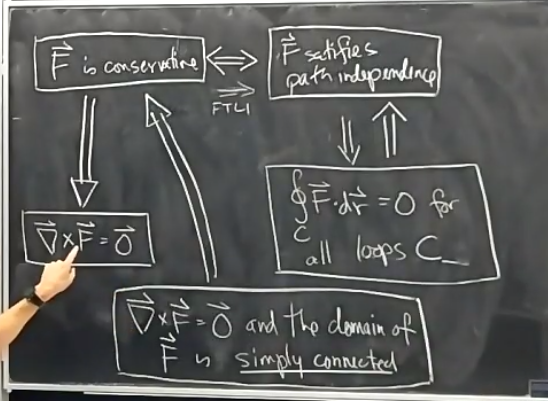

# Twenty-Third Class
* Work
  * We write $-C$ for same curve, opposite orientation
  * $\int_{-C}\vec F\cdot d\vec r=-\int_C\vec F\cdot d\vec r$
* e.g. $\vec F=<x, x>$, $C$ is the curve $3x=y^2$ from $(0, 0)$ to $(3, 3)$
  * $\vec r(t)=<\frac13t^2, t>$, $0\leq t\leq 3$
  * $\frac{d\vec r}{dt}=<\frac23t, 1>$
  * $\vec F(\vec r(t))=\vec F(x(t), y(t))=<x, x>=<\frac13t^2, \frac13t^2>$
  * $\int_C\vec F\cdot d\vec r=\int_{t=0}^3<\frac13t^2, \frac13t^2>\cdot <\frac23t, 1>dt=\int_{t=0}^3(\frac29t^3+\frac{t^2}{3})dt$
  * $=[\frac29\frac{t^4}4+\frac{t^3}{9}]_0^3=\frac{15}2$
  * Equivalent to $\int_C(xdx+dy)=\int_C(x\frac{dx}{dt}+x\frac{dy}{dt})dt$
  * Different curves do not always have worked applied to them
* Fundamental theorem of line integrals
  * FTLI: If $\vec F=\vec \nabla f$, then $\int_C\vec F\cdot d\vec r=f(p_2)-f(p_1)$
  * Theorem is sort of amazing since the hypothesis is a local condition whereas the conclusion is a global result
* $\vec F$ satisfies the path independence property if $\int_C\vec F\cdot d\vec r$ only depend on the endpoints
  * $\vec F$ conservative $(1)$ $\Leftrightarrow$ $\vec F$ satisfies path independence $(2)$
  * Left to right is FTLI
  * $\oint_C\vec F\cdot d\vec r=0$ for all loops $C$ $(3)$
  * All these statements $(1), (2), (3)$ are logically equivalent
* Proof of $(3)\Rightarrow (2)$
  * Suppose two paths $C_1, C_2$ and two endpoints $P_2, P_1$
  * Observe that $C_1-C_2$ is a closed loop
  * $0=\oint_{c_1-c_2}\vec F\cdot d\vec r=\int_{C_1}\vec F\cdot d\vec r+\int_{-C_2}\vec F\cdot d\vec r=\int_{C_1}\vec F\cdot d\vec r-\int_{C_2}\vec F\cdot d\vec r$
  * Implies $\int_{C_1}\vec F\cdot d\vec r=\int_{-c_2}\vec F\cdot d\vec r$
* Proof of FTLI
  * Let $\vec r(t)=<x(t), y(t), z(t)>$ as $a\leq t\leq b$ is a parameterization of $C$, $\vec F=\vec\nabla f=f_x\vec i+f_y\vec j+f_z\vec k$
  * $\int_C\vec F\cdot d\vec r=\int_{t=1}^b<\frac{\partial f}{\partial x}, \frac{\partial f}{\partial y}, \frac{\partial f}{\partial z}>\cdot <\frac{dx}{dt}, \frac{dy}{dt}, \frac{dz}{dt}>dt$
  * $=\int_{t=a}^b(\frac{\partial f}{\partial x}\frac{dx}{dt}+\frac{\partial f}{\partial y}\frac{dy}{dt}+\frac{\partial f}{\partial z}\frac{dz}{dt})dt=\int_{t=a}^b\frac{d}{dt}(f(x(t), y(t), z(t))dt$
  * $=f(x(b), y(b), z(b))-f(x(a), y(a), z(a))=f(p_2)-f(p_1)$
* $\vec F$ conservative $\Rightarrow$ $\vec\nabla\times\vec F=\vec 0$
  * Reverse is also true, but requires also that domain of $\vec F$ is simply connected (one uninterupted region)
  * i.e. curl is zero everywhere
  * 
* Recall if $\vec F=P(x, y, z)\vec i+Q(x, y, z)\vec j+R(x, y, z)\vec k$ then $\vec\nabla\times\vec F=\begin{bmatrix}\vec i&\vec j&\vec k\\\frac{\partial}{\partial x}&\frac{\partial}{\partial y}&\frac{\partial}{\partial z}\\P&Q&R\end{bmatrix}$
  * If $\vec F=P(x, y)\vec i+Q(x, y)\vec j$ if we regard this as a vector field in 3 space then $curl\vec F=(Q_x-P_y)\vec k$
* A domain $D$ in $\R^2$ (or $\R^3$) is simply connected if every loop $\gamma$ in $D$ is the boundary of closed region
  * i.e. no holes in $D$
  * For example $\R^3-\{(0, 0, 0)\}$ is simply connected
  * $\R^3-\{\textnormal{z-axis}\}$ is not