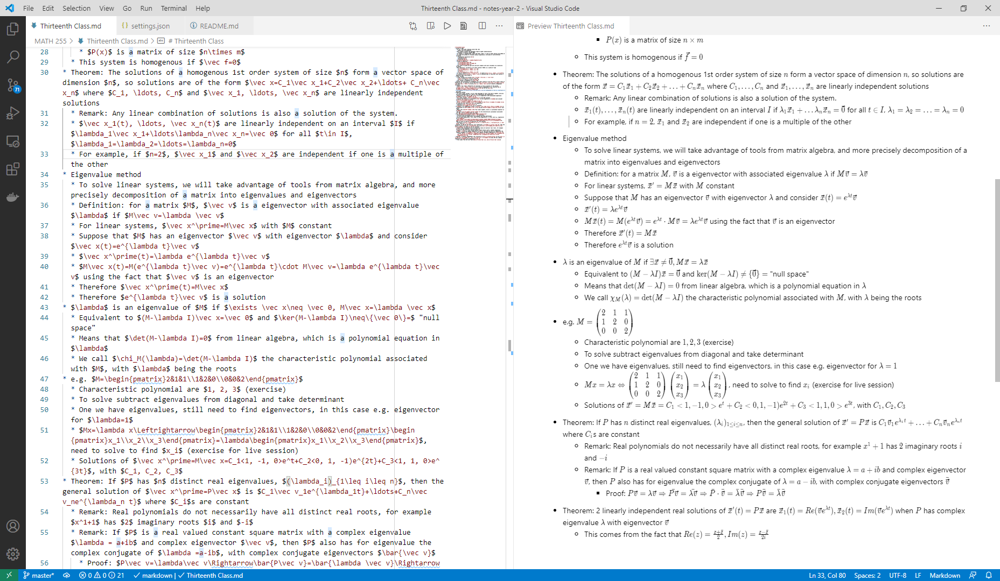

# Year 2 Notes

These are my notes for second year Engineering at UBC. They were originally on Boostnote before I got fed up of the platform and moved to VSCode markdown. 

## Setup

Unfortunately, Github does not support (easily implemented) math markdown equations, so the only way to nicely view these notes is to pull the repo and set up a markdown viewer. I personally use VSCode. To setup, pull the code from github and download VSCode [here](https://code.visualstudio.com/download). Download the Markdown+Math extension and optionally Markdown All in One. Also, open ```settings.json``` (Ctrl+P and type settings.json) and add the following: 

```
"mdmath.delimiters": "dollars", 
"mdmath.macros": {
    "\\R": "\\mathbb{R}",
    "\\vek": "{\\begin{pmatrix}#1\\\\#2\\end{pmatrix}}"
}
```
I'll probably add more macros as I realize more helpful shortcuts (this wasn't an option in Boostnote). You should now be able to open all of the notes in the preview pane with beautifully rendered LaTeX math. 



## Useful commands I'll forget:

To fix Boostnote export images, run following command in root folder: 

```
find . -type f -name '*.md' -exec sed -i 's|(attachments\/[a-z0-9\-]*\/\([a-z0-9]*\).png)|(attachments/\1.png)|' {} +
```
